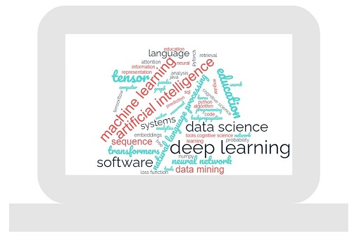

<!--   -->

I am a Computer Science Ph.D. graduate from the University of Memphis, where I conducted my research under the supervision of Dr. Vasile Rus in the Language and Information Processing Lab. My primary research focuses on applying natural language  processing techniques to source code to tackle various challenges. I am also passionate about the application of AI in education, particularly in developing dialogue-based tutoring systems aimed at helping beginner students (CS1 and CS2) improve their understanding of Java programming.
## Professional

Before joining the University of Memphis I worked as a full time software engineer for Zakipoint Health.

## Personal

In my spare time I like to explore the outdoor spaces indulging myself into physical activities like cycling, hiking, trekking. I also love reading book, practising yoga and mindfulness and gardening.
